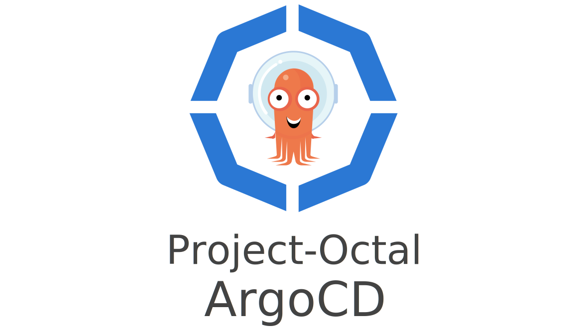

---

Simplifies the deployment and management of ArgoCD on a Kubernetes cluster.

**New in `v1.0.0`:**
* No longer relies on the `banzaicloud/k8s` provider.
* Can be deployed alongside any ingress controller.
* Deployable without SSL (if you're into that kind of thing...)
* This module no longer relies on external modules.

---

## IMPORTANT: Upgrading from v0.0.X to v1.0.X
If you're currently on version `v0.0.5` or older the following steps need to be followed to prevent potential disruption. The following steps assume the root ArgoCD module was created with the name `my_argocd`
```shell
# Import the ArgoCD CRDs
terraform import -var-file=secrets.tfvars 'module.my_argocd.kubernetes_manifest.app_projects' "apiVersion=apiextensions.k8s.io/v1,kind=CustomResourceDefinition,name=appprojects.argoproj.io"
terraform import -var-file=secrets.tfvars 'module.my_argocd.kubernetes_manifest.applications' "apiVersion=apiextensions.k8s.io/v1,kind=CustomResourceDefinition,name=applications.argoproj.io"

# Delete the old ArgoCD CRD references from the statefile
terraform state rm 'module.my_argocd.k8s_manifest.app_projects'
terraform state rm 'module.my_argocd.k8s_manifest.applications'

# Lastly, run a Terraform apply to make sure the states are synced up.
terraform apply -var-file secrets.tfvars
```

---

### Example
```hcl-terraform
module "argocd" {
  source  = "project-octal/argocd/kubernetes"
  version = "1.0.0"

  namespace              = "kube-argocd"
  argocd_server_replicas = 2
  argocd_repo_replicas   = 2
  enable_dex             = false

  ingress_enabled    = true
  ingress_host       = "argocd.arroyo.turnbros.app"
  ingress_path       = "/"
  ingress_class_name = module.traefik.ingress_class
  ingress_annotations = {
    "traefik.ingress.kubernetes.io/router.entrypoints" : "websecure"
    "traefik.ingress.kubernetes.io/router.tls" : "true"
  }
  ingress_cert_issuer_annotation = {
    "cert-manager.io/cluster-issuer" : module.cert_manager.cert_issuer
  }

  argocd_server_requests = {
    cpu = "300m"
    memory = "256Mi"
  }
  argocd_server_limits = {
    cpu = "600m"
    memory = "512Mi"
  }

  repo_server_exec_timeout = "300"
  argocd_repo_requests = {
    cpu = "300m"
    memory = "256Mi"
  }
  argocd_repo_limits = {
    cpu = "600m"
    memory = "512Mi"
  }
  argocd_repositories = [
    {
      name = "Helm-Main"
      type = "helm"
      url = "https://charts.helm.sh/stable"
    }
  ]

  oidc_config = {
    name                      = var.argocd_oidc_name
    issuer                    = var.argocd_oidc_issuer
    client_id                 = var.argocd_oidc_client_id
    client_secret             = var.argocd_oidc_client_secret
    requested_scopes          = var.argocd_oidc_requested_scopes
    requested_id_token_claims = var.argocd_oidc_requested_id_token_claims
  }
}
```

<!-- BEGIN_TF_DOCS -->
## Requirements

| Name | Version |
|------|---------|
| <a name="requirement_terraform"></a> [terraform](#requirement\_terraform) | >= 0.14, < 2.0.0 |
| <a name="requirement_kubernetes"></a> [kubernetes](#requirement\_kubernetes) | ~> 2.6.1 |

## Providers

| Name | Version |
|------|---------|
| <a name="provider_kubernetes"></a> [kubernetes](#provider\_kubernetes) | 2.6.1 |

## Modules

| Name | Source | Version |
|------|--------|---------|
| <a name="module_argocd_application_controller"></a> [argocd\_application\_controller](#module\_argocd\_application\_controller) | ./argocd-application-controller | n/a |
| <a name="module_argocd_dex"></a> [argocd\_dex](#module\_argocd\_dex) | ./argocd-dex | n/a |
| <a name="module_argocd_redis"></a> [argocd\_redis](#module\_argocd\_redis) | ./argocd-redis | n/a |
| <a name="module_argocd_repo_server"></a> [argocd\_repo\_server](#module\_argocd\_repo\_server) | ./argocd-repo-server | n/a |
| <a name="module_argocd_server"></a> [argocd\_server](#module\_argocd\_server) | ./argocd-server | n/a |

## Resources

| Name | Type |
|------|------|
| [kubernetes_config_map.argocd_cm](https://registry.terraform.io/providers/hashicorp/kubernetes/latest/docs/resources/config_map) | resource |
| [kubernetes_config_map.argocd_gpg_keys_cm](https://registry.terraform.io/providers/hashicorp/kubernetes/latest/docs/resources/config_map) | resource |
| [kubernetes_config_map.argocd_rbac_cm](https://registry.terraform.io/providers/hashicorp/kubernetes/latest/docs/resources/config_map) | resource |
| [kubernetes_config_map.argocd_redis_ha_configmap](https://registry.terraform.io/providers/hashicorp/kubernetes/latest/docs/resources/config_map) | resource |
| [kubernetes_config_map.argocd_ssh_known_hosts_cm](https://registry.terraform.io/providers/hashicorp/kubernetes/latest/docs/resources/config_map) | resource |
| [kubernetes_config_map.argocd_tls_certs_cm](https://registry.terraform.io/providers/hashicorp/kubernetes/latest/docs/resources/config_map) | resource |
| [kubernetes_manifest.app_projects](https://registry.terraform.io/providers/hashicorp/kubernetes/latest/docs/resources/manifest) | resource |
| [kubernetes_manifest.applications](https://registry.terraform.io/providers/hashicorp/kubernetes/latest/docs/resources/manifest) | resource |
| [kubernetes_namespace.argocd_namespace](https://registry.terraform.io/providers/hashicorp/kubernetes/latest/docs/resources/namespace) | resource |
| [kubernetes_secret.argocd_secret](https://registry.terraform.io/providers/hashicorp/kubernetes/latest/docs/resources/secret) | resource |

## Inputs

| Name | Description | Type | Default | Required |
|------|-------------|------|---------|:--------:|
| <a name="input_argocd_git_repositories"></a> [argocd\_git\_repositories](#input\_argocd\_git\_repositories) | A list of credentials that ArgoCD will use when pulling from configured repositories. | `list(map(any))` | `[]` | no |
| <a name="input_argocd_image_name"></a> [argocd\_image\_name](#input\_argocd\_image\_name) | The image to use when deploying ArgoCD | `string` | `"argoproj/argocd"` | no |
| <a name="input_argocd_image_repository"></a> [argocd\_image\_repository](#input\_argocd\_image\_repository) | The image repository to use when pulling images. | `string` | `"docker.io"` | no |
| <a name="input_argocd_image_tag"></a> [argocd\_image\_tag](#input\_argocd\_image\_tag) | The version of ArgoCD to deploy. | `string` | `"v2.2.2"` | no |
| <a name="input_argocd_repo_limits"></a> [argocd\_repo\_limits](#input\_argocd\_repo\_limits) | n/a | <pre>object({<br>    cpu : optional(string)<br>    memory : optional(string)<br>  })</pre> | <pre>{<br>  "cpu": null,<br>  "memory": null<br>}</pre> | no |
| <a name="input_argocd_repo_replicas"></a> [argocd\_repo\_replicas](#input\_argocd\_repo\_replicas) | ##################################### # ArgoCD Repo Server Configuration ## ##################################### | `number` | `2` | no |
| <a name="input_argocd_repo_requests"></a> [argocd\_repo\_requests](#input\_argocd\_repo\_requests) | n/a | <pre>object({<br>    cpu : optional(string)<br>    memory : optional(string)<br>  })</pre> | <pre>{<br>  "cpu": null,<br>  "memory": null<br>}</pre> | no |
| <a name="input_argocd_repositories"></a> [argocd\_repositories](#input\_argocd\_repositories) | A list of repositories that ArgoCD might pull from. | `list(map(any))` | `[]` | no |
| <a name="input_argocd_repository_credentials"></a> [argocd\_repository\_credentials](#input\_argocd\_repository\_credentials) | A list of repositories that ArgoCD might pull from. | `list(map(any))` | `[]` | no |
| <a name="input_argocd_server_limits"></a> [argocd\_server\_limits](#input\_argocd\_server\_limits) | n/a | <pre>object({<br>    cpu : string<br>    memory : string<br>  })</pre> | <pre>{<br>  "cpu": null,<br>  "memory": null<br>}</pre> | no |
| <a name="input_argocd_server_replicas"></a> [argocd\_server\_replicas](#input\_argocd\_server\_replicas) | #################################### # ArgoCD App Server Configuration ## #################################### | `number` | `2` | no |
| <a name="input_argocd_server_requests"></a> [argocd\_server\_requests](#input\_argocd\_server\_requests) | n/a | <pre>object({<br>    cpu : string<br>    memory : string<br>  })</pre> | <pre>{<br>  "cpu": null,<br>  "memory": null<br>}</pre> | no |
| <a name="input_dex_image_name"></a> [dex\_image\_name](#input\_dex\_image\_name) | The name of the Dex image to use | `string` | `"dexidp/dex"` | no |
| <a name="input_dex_image_repository"></a> [dex\_image\_repository](#input\_dex\_image\_repository) | The repository that the dex image will be obtained from | `string` | `"docker.io"` | no |
| <a name="input_dex_image_tag"></a> [dex\_image\_tag](#input\_dex\_image\_tag) | The version of the Dex Docker image to deploy. | `string` | `"2.30.0"` | no |
| <a name="input_enable_anonymous_access"></a> [enable\_anonymous\_access](#input\_enable\_anonymous\_access) | Enables anonymous user access. The anonymous users get default role permissions specified argocd-rbac-cm.yaml. | `bool` | `false` | no |
| <a name="input_enable_dex"></a> [enable\_dex](#input\_enable\_dex) | Determines whether or not to deploy Dex alongside ArgoCD | `bool` | `true` | no |
| <a name="input_enable_ha_redis"></a> [enable\_ha\_redis](#input\_enable\_ha\_redis) | n/a | `bool` | `false` | no |
| <a name="input_enable_status_badge"></a> [enable\_status\_badge](#input\_enable\_status\_badge) | Enables application status badge feature | `bool` | `false` | no |
| <a name="input_haproxy_image_name"></a> [haproxy\_image\_name](#input\_haproxy\_image\_name) | n/a | `string` | `"haproxy"` | no |
| <a name="input_haproxy_image_repository"></a> [haproxy\_image\_repository](#input\_haproxy\_image\_repository) | n/a | `string` | `"docker.io"` | no |
| <a name="input_haproxy_image_tag"></a> [haproxy\_image\_tag](#input\_haproxy\_image\_tag) | Defines which docker image tag to use for HAProxy | `string` | `"2.4.8-alpine"` | no |
| <a name="input_helm_chat_text"></a> [helm\_chat\_text](#input\_helm\_chat\_text) | The text for getting chat help | `string` | `"Chat now!"` | no |
| <a name="input_help_chat_url"></a> [help\_chat\_url](#input\_help\_chat\_url) | The URL for getting chat help, this will typically be your Slack channel for support | `string` | `null` | no |
| <a name="input_image_pull_policy"></a> [image\_pull\_policy](#input\_image\_pull\_policy) | Determines when the image should be pulled prior to starting the container. `Always`: Always pull the image. \| `IfNotPresent`: Only pull the image if it does not already exist on the node. \| `Never`: Never pull the image | `string` | `"Always"` | no |
| <a name="input_ingress_annotations"></a> [ingress\_annotations](#input\_ingress\_annotations) | A map of annotations to add to the ingress resource | `map(string)` | `{}` | no |
| <a name="input_ingress_cert_issuer_annotation"></a> [ingress\_cert\_issuer\_annotation](#input\_ingress\_cert\_issuer\_annotation) | The cluster certificate issuer to use when creating a TLS certificate for the ingress. needs to be set here so the tls block is defined on the ingress resource. | `map(string)` | `{}` | no |
| <a name="input_ingress_class_name"></a> [ingress\_class\_name](#input\_ingress\_class\_name) | The ingress class that the ArgoCD ingress record should reference. | `string` | `null` | no |
| <a name="input_ingress_enabled"></a> [ingress\_enabled](#input\_ingress\_enabled) | If set to `true` an ingress route will be created for ArgoCD | `bool` | `true` | no |
| <a name="input_ingress_host"></a> [ingress\_host](#input\_ingress\_host) | Argo CD's externally facing host. Required when configuring SSO | `string` | `null` | no |
| <a name="input_ingress_path"></a> [ingress\_path](#input\_ingress\_path) | A string or an extended POSIX regular expression as defined by IEEE Std 1003.1 | `string` | `"/"` | no |
| <a name="input_labels"></a> [labels](#input\_labels) | Extra Kubernetes labels to include with the resources created by this module | `map(string)` | `{}` | no |
| <a name="input_namespace"></a> [namespace](#input\_namespace) | The namespace this ArgoCD deployment will reside in. | `string` | `"argocd"` | no |
| <a name="input_namespace_annotations"></a> [namespace\_annotations](#input\_namespace\_annotations) | Additional ArgoCD namespace annotations (e.g. for `linkerd.io/inject: enabled` for mesh things) | `map(string)` | `{}` | no |
| <a name="input_oidc_config"></a> [oidc\_config](#input\_oidc\_config) | OIDC authorization provider settings. For more information please refer to: https://argoproj.github.io/argo-cd/operator-manual/user-management/#existing-oidc-provider | <pre>object({<br>    name : string,<br>    issuer : string,<br>    client_id : string,<br>    client_secret : string,<br>    requested_scopes : list(string),<br>    requested_id_token_claims : map(any)<br>  })</pre> | `null` | no |
| <a name="input_pod_affinity_topology_key"></a> [pod\_affinity\_topology\_key](#input\_pod\_affinity\_topology\_key) | n/a | `string` | `"failure-domain.beta.kubernetes.io/zone"` | no |
| <a name="input_redis_image_name"></a> [redis\_image\_name](#input\_redis\_image\_name) | n/a | `string` | `"redis"` | no |
| <a name="input_redis_image_repository"></a> [redis\_image\_repository](#input\_redis\_image\_repository) | n/a | `string` | `"docker.io"` | no |
| <a name="input_redis_image_tag"></a> [redis\_image\_tag](#input\_redis\_image\_tag) | The version of the Redis Docker image to deploy. | `string` | `"6.2.6-alpine"` | no |
| <a name="input_repo_server_exec_timeout"></a> [repo\_server\_exec\_timeout](#input\_repo\_server\_exec\_timeout) | n/a | `string` | `"90s"` | no |
| <a name="input_repository_credentials"></a> [repository\_credentials](#input\_repository\_credentials) | A list of git repositories that ArgoCD will be configured to use. | `list(map(any))` | `[]` | no |

## Outputs

| Name | Description |
|------|-------------|
| <a name="output_namespace"></a> [namespace](#output\_namespace) | n/a |
<!-- END_TF_DOCS -->

